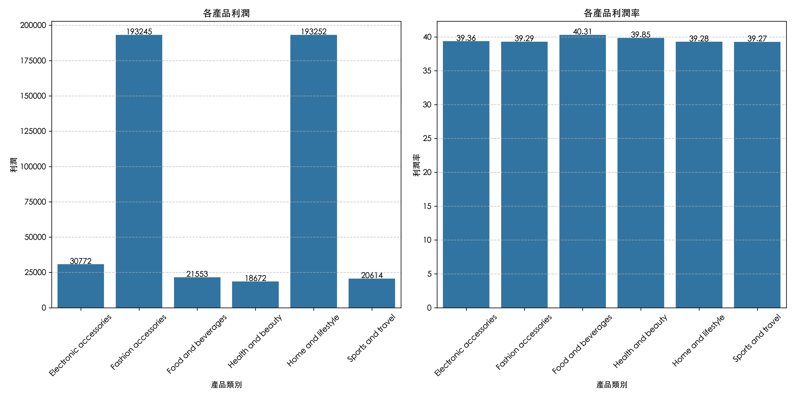
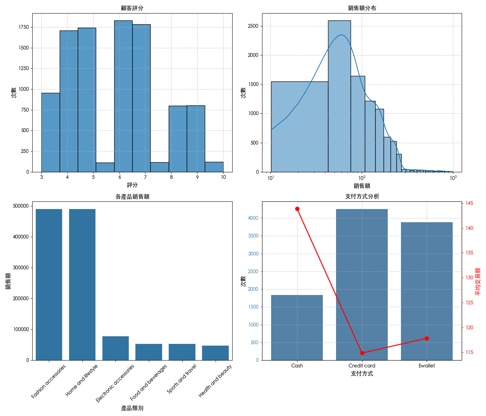
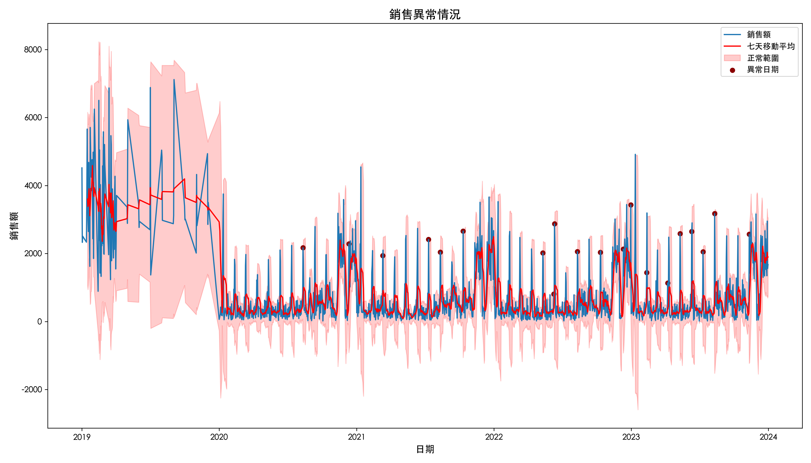
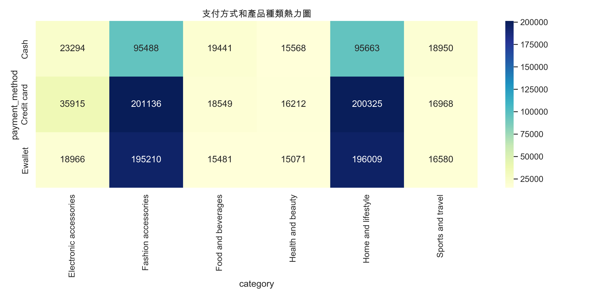

# Walmart 零售數據分析與優化策略

## 專案概述
本專案針對 Walmart 銷售資料，透過探索性分析、時間序列拆解、產品獲利能力評估與統計驗證，逐步提出資料驅動的四大優化策略，改善營收集中風險、促進淡季銷售回升、提升顧客價值與支付轉換率。

---
## 分析設計邏輯

為有效對應零售場景需求，分析流程依以下邏輯進行設計：

- **探索性分析**：快速掌握顧客評分、支付方式與消費分布特性。
- **時間序列分析**：找出銷售波動週期與異常高峰，指導促銷與人力安排。
- **類別與獲利分析**：評估產品獲利結構與顧客分層，挖掘潛力品項與定價策略。
- **統計驗證與洞察整合**：使用 ANOVA / OLS 驗證趨勢差異，確保策略有數據支撐。

## 關鍵洞察 Key Insights

### 1.銷售過度集中
僅 Fashion 與 Home 兩大類別佔據超過 75% 銷售額，存在營收過度集中風險。

### 2.顧客評分多峰
評分主要集中在 4、5、7、9 四個點，顯示顧客體驗與期望落差明顯。

### 3.月中異常高峰
年底為銷售旺季，且每月 11 日頻繁出現銷售異常高點，以下表格為20個最大異常點發生在11號的統計次數。
 ***可以發現在2022和2023年次數更多異常倍數也變大(七天平均)***

| 年份 | 出現次數 | 異常總銷售額 | 平均異常倍數 |
|------|----------|--------------|---------------|
| 2020 |    2     |     4453     |     2.19      |
| 2021 |    3     |     8991     |     2.19      |
| 2022 |    6     |    14446     |     2.21      |
| 2023 |    6     |    14435     |     2.22      |

### 支付方式與消費顯著相關
統計檢定（ANOVA + OLS）顯示，不同支付方式對消費金額具顯著影響。
- 現金用戶為高價值顧客，單筆消費金額顯著高
- 電子錢包偏好快速結帳，整體消費低但頻繁

---

## 商業建議與策略方向

### 1. 產品策略
- 培養 Food / Health 潛力品項，降低對 Fashion / Home 的依賴
- Food 可作為導流商品，Health 適合提升品牌形象與毛利結構

### 2. 時間策略
- 建立「11 號促銷日」作為固定活動，穩定月中銷售
- 淡季期間（4~7 月）推動補強活動，提高整年平均表現

### 3. 顧客策略
- 建立會員分層制度，針對高價值顧客設計定向回饋
- 針對低評分族群優化服務流程，提高滿意度

### 4. 支付策略
- 電子錢包族群偏好單品快速結帳，建議設計即時單品優惠
- 對高價現金客群導入忠誠回饋制度，提升 CLV（顧客終身價值）
- 可對於主力信用卡用戶建立積分優惠

---

## 分析方法與技術工具

| 方法類型 | 工具與技術 |
|----------|-------------|
| 資料處理 | Python, Pandas, NumPy |
| 可視化 | Matplotlib, Seaborn |
| 統計分析 | ANOVA, OLS (Statsmodels, SciPy) |
| 商業分析 | BCG 矩陣、客戶層級分析、時間趨勢拆解 |
| 模型與檢定 | 趨勢分解、異常偵測、交叉分析熱力圖 |

---

## 專案結構

| Notebook | 分析內容 | 說明 |
|----------|----------|------|
| `01_data_exploration.ipynb` | 探索性分析 | 顧客評分、支付方式、產品類別銷售觀察 |
| `02_time_pattern_analysis.ipynb` | 銷售時間趨勢分析 | 趨勢、季節性、11日異常模式與促銷潛力 |
| `03_product_profit_analysis.ipynb` | 產品與消費層級分析 | BCG矩陣、潛力商品分析、客層分層行為 |
| `04_business_recommendations.ipynb` | 綜合策略建議與效益分析 | 統計檢定、策略設計、預期成效與限制整理 |

---

## 預期效益與分析限制

### 成效預估
- 若 11 號促銷成功導入，淡季銷售可望提升 10~15%
- 若 Food / Health 提升市佔 5%，可降低依賴主力品項風險
- 精準支付策略可提高年輕用戶轉換與回購率

### 分析限制
- 分析資料範圍為 2019–2024，且非完整連續
- 資料中無完整會員標記與歷史行銷紀錄
- 預測成效需依未來 A/B Test 與實際行銷實施而定

---

> 本專案為資料分析展示作品集，完整呈現資料處理、洞察生成與策略設計流程，適用於產品分析與行銷分析等職位申請與展示。